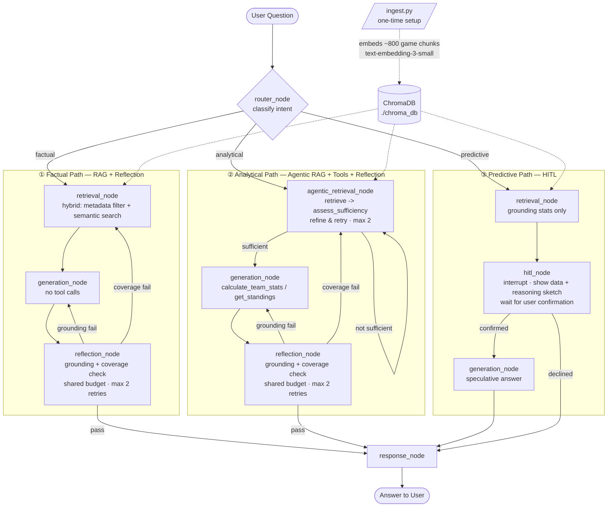
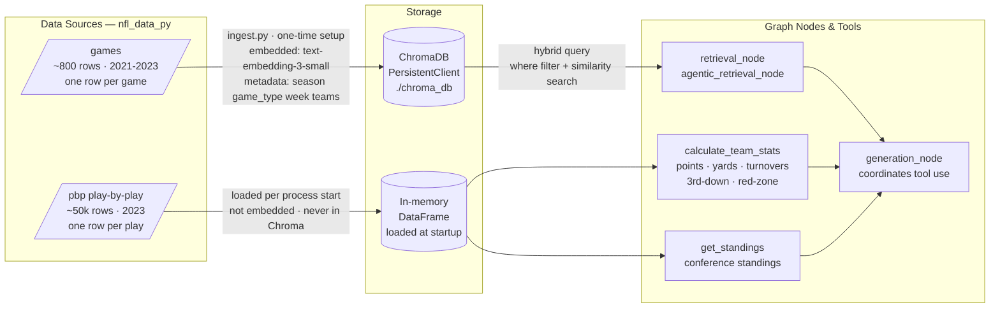
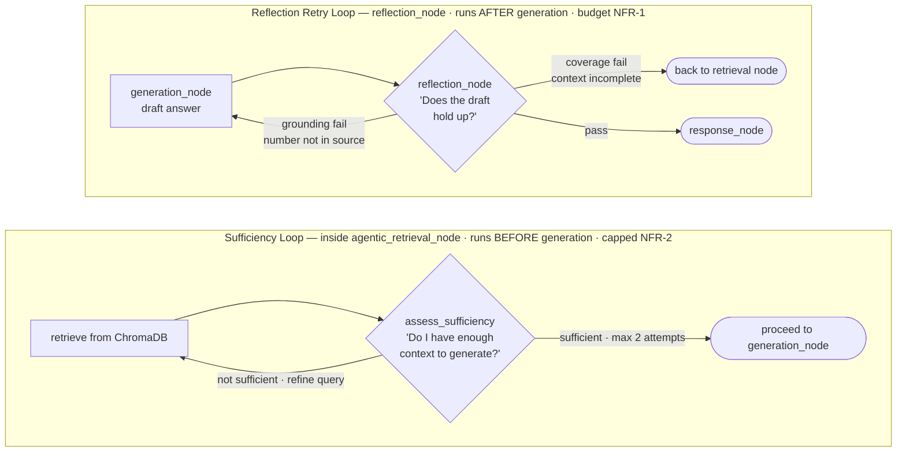
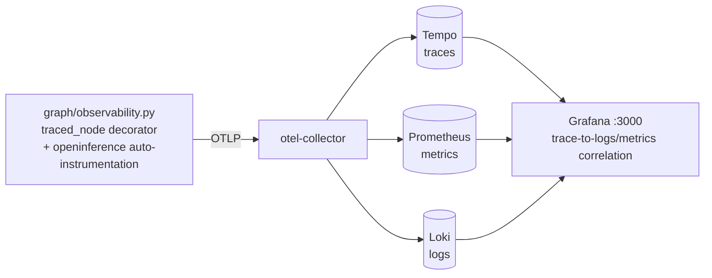

# Architecture — NFL Stats Agent

See [README.md](README.md) for the governing principle and locked stack.
See [ADRs.md](ADRs.md) for why each contested choice below won over its
alternatives.

## Design tenets

1. **Pattern-boundary integrity** (the governing principle) — every node
   below maps to exactly one pattern; nothing is shared across patterns as a
   shortcut.
2. **`games` → RAG, `pbp` → tools, never embedded.** The play-by-play
   DataFrame never enters Chroma; anything needing per-play arithmetic is a
   tool call, not a retrieval.
3. **Hybrid retrieval, not pure vector search.** Discrete, unambiguous fields
   (`season`, `game_type`, `week` when stated) go into a Chroma `where`
   filter; anything ambiguous (team names, underspecified game) stays in the
   semantic query — see `FR-1.1`.
4. **Two loops, never merged.** `assess_sufficiency` (pre-generation, "do I
   have enough context") and `reflection_node`'s retry loop (post-generation,
   "did the answer hold up") are separate cycles even though both can route
   back to a retrieval step.
5. **No LLM hard-coupling.** The generation model is selected by config
   (`init_chat_model`), not imported as a vendor SDK call baked into node
   code — see [ADR-006](ADRs.md#adr-006).

## High-level architecture

`ingest_node` is not in this graph — it's the one-time setup script
(`data/ingest.py`), run once before the chat graph ever starts.

## Tiers / components

| Component | Responsibility | Backing data | Pattern |
|---|---|---|---|
| `router_node` | Classifies intent: factual / analytical / predictive | — | Routing (`FR-0.x`) |
| `retrieval_node` | Hybrid query: metadata `where` filter + semantic search, single hop | `games` in Chroma | RAG (`FR-1.x`) |
| `agentic_retrieval_node` | retrieve → `assess_sufficiency` → refine-and-retry loop | `games` in Chroma | Agentic RAG (`FR-2.x`) |
| `generation_node` | Claude/LLM call; tool use only on the analytical path | — | Tool calling (`FR-3.x`) on analytical path; plain generation elsewhere |
| `calculate_team_stats` tool | Arithmetic over individual plays | `pbp` DataFrame, in-memory | Tool calling (`FR-3.x`) |
| `get_standings` tool | Aggregates game results | `games` DataFrame, in-memory | Tool calling (`FR-3.x`) |
| `reflection_node` | Grounding + coverage check on the drafted answer | the answer + whatever context/tool results produced it | Reflection (`FR-4.x`) |
| `hitl_node` | `interrupt()`: show grounding stats + reasoning sketch, wait for user confirm | output of `retrieval_node`/tools | HITL (`FR-5.x`) |
| `response_node` | Terminal formatting/return to UI | — | — |
| `MemorySaver` checkpointer | Persists graph state across the interrupt/resume boundary | in-process | HITL (`FR-5.x`) |
| Streamlit UI | Chat loop, `st.status` step visibility, imports compiled graph directly | — | — |

### Data-source routing (ADR-007)

Two data sources, two access patterns — the boundary between them is structural (which store the data lives in), not a prompting convention.

### Loop separation (ADR-004)

Two loops both route back to retrieval — but they ask different questions at different times and must stay separate (see [ADR-004](ADRs.md#adr-004)).

## Key flows

**Factual:** `router_node` → `retrieval_node` (filter + semantic query) →
`generation_node` (answers from the one chunk, no tools) → `reflection_node`
→ pass → `response_node`; on failure, loops back per the shared budget
(`NFR-1`).

**Analytical:** `router_node` → `agentic_retrieval_node` (loop until
`assess_sufficiency` is satisfied or `NFR-2`'s cap is hit) → `generation_node`
(tool calls: `calculate_team_stats` and/or `get_standings`, possibly more
than once in one turn) → `reflection_node` → pass → `response_node`; on
failure, grounding routes to `generation_node`, coverage routes back to
`agentic_retrieval_node`.

**Predictive:** `router_node` → `retrieval_node` (grounding stats only) →
`hitl_node` (`interrupt()`, shows data + reasoning sketch) → user confirms or
declines → confirmed: `generation_node` produces the speculative answer →
`response_node`; declined: straight to `response_node` with no prediction
generated. No `reflection_node` on this path — there's nothing to
ground-check on an intentionally speculative answer.

## Multi-tenancy & isolation

Not applicable. There is one local user and one Streamlit session at a time;
`thread_id` in the LangGraph config distinguishes conversation threads, not
tenants. No data isolation boundary exists or is needed (see [PRD.md
§Excluded](PRD.md#goals--non-goals)).

## Scale & capacity model

The only scale this system is designed for — not a floor to grow from:

| Dimension | Value |
|---|---|
| `games` corpus (embedded) | ~800 rows / chunks (2021–2023 schedules) |
| `pbp` corpus (in-memory, tool-only) | ~50k rows (2023 season) |
| Concurrent sessions | 1 |
| Concurrent users | 1 |
| Persistence | Local disk (`./chroma_db`), single process |

No load testing, autoscaling, or multi-session concurrency work is planned;
see [PRD.md §Excluded](PRD.md#goals--non-goals).

## Failure modes & degradation

| Tier | What breaks | What the system does |
|---|---|---|
| Chroma query (`retrieval_node` / `agentic_retrieval_node`) | Query raises or returns zero rows | Surface as a coverage failure to `reflection_node` (factual/analytical paths) rather than crashing the graph |
| LLM tool call | Model emits a malformed tool call or invalid args | LangGraph/LangChain tool-binding error surfaces to the user via the UI; not retried automatically — out of scope to build a tool-call-repair loop |
| Reflection retry budget exhausted (`NFR-1`) | Grounding/coverage still failing after 2 retries | `response_node` returns the best available answer with an appended caveat noting unconfirmed grounding/coverage, instead of looping further or failing silently (*Assumption* — see [REQUIREMENTS.md §Open Assumptions](REQUIREMENTS.md#open-assumptions)) |
| `agentic_retrieval_node`'s sufficiency loop exhausted (`NFR-2`) | Still insufficient context after the cap | Proceeds to `generation_node` with whatever context was gathered; relies on `reflection_node`'s coverage check as the backstop rather than a second cap doing the same job |
| `nfl_data_py` source unreachable | Ingestion (`data/ingest.py`) fails | One-time setup-script failure, not a runtime/demo failure — blocks that phase of the build until the source is reachable again |
| LLM provider/model swap (`ADR-006`) | Underlying model has weaker tool-calling or instruction-following | Default stays Claude Sonnet 4.6; any swap is opt-in and should be re-verified against the Test Queries before trusting it |

## Cross-cutting

- **Security:** local-only, single trusted user, public data, no PII. API
  keys (`ANTHROPIC_API_KEY` or equivalent for whichever model is configured,
  `OPENAI_API_KEY` for embeddings) via `.env`, never committed.
- **Idempotency:** ingestion upserts into Chroma by chunk ID, so re-running
  `ingest.py` doesn't duplicate chunks.
- **Consistency:** single writer (the ingestion script), single reader
  process (the chat graph) — no concurrent-write consistency concerns.
- **Config/secrets:** `.env` holds API keys and the configured generation
  model/provider (`NFR-3`); nothing model-specific is hardcoded in node code.

## Observability (ADR-008)

Dev-time transparency into what each node is doing — distinct from, and not
a contradiction of, [PRD.md §Excluded](PRD.md#goals--non-goals)'s exclusion
of production-scale monitoring.

- One root trace per `graph.invoke()` call, one child span per node visited
  (including repeat visits across the reflection/sufficiency retry loops),
  one grandchild span per LLM call (prompt/completion/tokens, auto-captured).
- `ui/app.py` renders a per-answer "Reasoning trail" expander (intent,
  filters used, retry count, last failure) with a deep link into the
  matching Grafana trace.
- Run the stack: `docker compose -f observability/docker-compose.yml up -d`,
  then open Grafana at `localhost:3001` (anonymous admin, local-only; mapped
  off the default 3000 to avoid colliding with other local dev servers).
