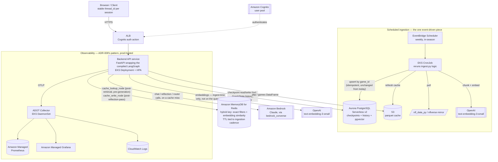

# Production Deployment — Blitz NFL Agent

See [README.md](README.md) for the base project's governing principle and
locked stack, and [ARCHITECTURE.md](ARCHITECTURE.md) for the graph this doc
deploys — nothing here changes the five-pattern graph itself. See
[ADRs.md](ADRs.md) for the decisions referenced below (`ADR-009` onward were
added alongside this doc).

## Scope & how this doc relates to the rest of the suite

[PRD.md §Goals & Non-Goals](PRD.md#goals--non-goals) explicitly excludes
deployment, auth, and multi-tenancy — that exclusion described the learning
exercise the rest of `docs/` documents, and it still accurately describes
that project. This doc is an **additive, forward-looking extension**: it
answers "how would you actually run this for real users," without changing
anything the base suite decided about the graph, the patterns, or their
boundaries.

**What stays exactly as-is:** the factual/analytical/predictive routing, the
reflection retry budget (`NFR-1`/`NFR-2`), the hybrid retrieval split
(`ADR-003`), the tool-vs-RAG data boundary (`ADR-007`), and the
no-`compare_teams` tool-calling decision (`ADR-005`). Pattern-Boundary
Integrity governs the graph in production exactly as it does today.

**Amendment:** two later additions to this doc — the semantic response
cache ([ADR-015](ADRs.md#adr-015)) and conversational memory
([ADR-016](ADRs.md#adr-016)) — *do* touch `graph/build.py` and
`graph/state.py` (new nodes/edges, a new `GraphState` field). They're kept
in this doc rather than spun out because they're deployment-driven
(the cache only matters at production request volume; conversational
memory only matters once there are real multi-turn sessions), but they are
graph changes, not pure infrastructure — flagged here rather than silently
contradicting the paragraph above.

**What this doc changes:** everything *around* the graph — how it's hosted,
how many people can use it at once, where its data and checkpoint state
live, how it's secured, and how its corpus stays current. Concretely, this
means revisiting [ADR-002](ADRs.md#adr-002) (no backend), which was correct
for a single local user and stops being correct once concurrent multi-user
traffic exists.

## Governing principle for this doc: operational simplicity until traffic proves otherwise

> Add infrastructure complexity (services, queues, read/write model splits)
> only when a specific, named number in [§Target scale](#target-scale--traffic-shape)
> demands it — not because a pattern (microservices, event-driven, CQRS) is
> the "production-grade" thing to reach for. Every such addition below states
> the number that would justify it.

This is deliberately the mirror image of the base suite's principle: that
suite protects pedagogical seams between patterns; this doc protects
against over-building infrastructure for a workload that, at both target
tiers, remains genuinely small in absolute request volume (see the math
below).

## Target scale & traffic shape

| Dimension | Tier 1 (target) | Tier 2 (scale-up) |
|---|---|---|
| DAU | 1,000 | ~20,000 (proportional to question volume) |
| Questions/day | 5,000 | 100,000 |
| Avg steady-state rate¹ | ~0.10 req/s (~6/min) | ~2.0 req/s (~120/min) |
| Peak-window rate² | ~0.5 req/s sustained, low-double-digit req/s momentary bursts | ~10 req/s sustained, 30-50 req/s momentary bursts |
| Corpus (embedded) | `games`, growing weekly in-season | same, same growth rate |
| Corpus (tool-only) | `pbp`, ~50k rows/season | same |

¹ *Assumption:* usage concentrated in ~14 active hours/day, not flat across
24h.
² *Assumption:* NFL question traffic is inherently bursty by design of the
domain, not just generically "peaky" — Sunday (plus Thursday/Monday night
games) plausibly carries ~3x an average day's volume, concentrated in an
~8-hour live-game window; a specific play/result can spike momentary
traffic further. This shapes every capacity decision below more than the
daily-average number does.

Both tiers are small in absolute terms — even Tier 2's peak burst (tens of
req/s) is a workload a handful of container replicas handle comfortably.
The scale problem here is real but modest; it should not be over-solved.

## Architecture overview

## Components & the decisions behind them

| Component | Choice | Decision record |
|---|---|---|
| Compute | EKS (Deployment + HPA for the API; CronJob for ingestion) | [ADR-012](ADRs.md#adr-012) |
| Backend | FastAPI wrapping the compiled LangGraph, stateless pods | [ADR-009](ADRs.md#adr-009) |
| Chat LLM | Amazon Bedrock (Claude via `bedrock_converse`) | [ADR-010](ADRs.md#adr-010) |
| Embeddings | OpenAI `text-embedding-3-small`, unchanged, ingest-time only | [ADR-010](ADRs.md#adr-010) |
| Checkpointer | LangGraph's `PostgresSaver` on Aurora PostgreSQL Serverless v2 | [ADR-009](ADRs.md#adr-009) |
| Vector store | pgvector on the same Aurora cluster | [ADR-011](ADRs.md#adr-011) |
| Semantic response cache | Amazon MemoryDB for Redis, hybrid key (exact season/game_type/week/intent + embedding similarity), caches only reflection-passed answers | [ADR-015](ADRs.md#adr-015) |
| Conversational memory | Session-scoped `thread_id` + a new `GraphState.history` field (last N turns), read by router/retrieval/generation prompts | [ADR-016](ADRs.md#adr-016) |
| `pbp`/`games` tool cache | Parquet on S3, pulled at pod startup, refreshed by ingestion | — (replaces local `.nfl_cache/`) |
| Ingestion trigger | EventBridge Scheduler → EKS CronJob | [ADR-014](ADRs.md#adr-014) |
| Auth | Cognito user pool, ALB-native `authenticate-cognito` listener action | [ADR-013](ADRs.md#adr-013) |
| IaC | Terraform | — (team preference; no single "correct" answer, both are viable) |
| Secrets | AWS Secrets Manager, mounted via IRSA — no static AWS keys in pods | — |
| Observability | ADOT Collector → Amazon Managed Prometheus + Amazon Managed Grafana + CloudWatch Logs | extends [ADR-008](ADRs.md#adr-008) |

A few of these are worth stating plainly since they're easy to get wrong by
default:

- **Embeddings never sit on the query path.** `retrieval_node` and
  `agentic_retrieval_node` query pgvector directly; OpenAI is only called by
  the ingestion CronJob. An OpenAI outage degrades *next week's data
  refresh*, not live user traffic — a materially better failure mode than
  it looks like at first glance.
- **One database, not two.** Aurora hosts both the LangGraph checkpoint
  tables and the `games` vector column. At this corpus size (~800-1,500
  rows even after a full season of growth), a dedicated vector engine
  (OpenSearch Serverless) is unjustified operational surface — see
  [ADR-011](ADRs.md#adr-011) for the explicit revisit threshold.
- **No API Gateway at Tier 1.** ALB's native Cognito authentication action
  handles the one thing needed (reject unauthenticated requests before they
  reach the pod) without adding a second HTTP-routing layer. Revisit if
  per-client usage plans/quotas are needed (Tier 2, see below).

## Microservices, event-driven design, and CQRS — where each does and doesn't apply

The user's question deserves a direct answer, not a hedge: **at both target
tiers, none of these three patterns should be adopted wholesale.** Each is
evaluated on its own terms below, with the specific threshold that would
change the answer.

### Microservices

**Not adopted.** The system decomposes into exactly two deployable units
today — the API service (the whole compiled graph) and the ingestion job —
plus a frontend. Splitting the graph itself along pattern boundaries (a
"retrieval service," a "reflection service," a "tool-calling service") would
add a network hop per LangGraph node for a graph that already runs
sub-second in-process, with zero traffic-driven justification at either
tier, and it would ironically *weaken* Pattern-Boundary Integrity by turning
an observable in-process seam into brittle network contracts between
services owned by nobody in particular.

*Revisit when:* a specific pattern needs an independent deploy cadence,
independent scaling profile, or a separate owning team — e.g., if
`calculate_team_stats`/`get_standings` grow into a general stats API used by
other products, not just this agent's tool calls.

### Event-driven design

**Adopted in exactly one place: ingestion.** The weekly data refresh
(§Architecture overview) is genuinely decoupled, asynchronous, and
schedule-triggered — this is real event-driven design, not a stretch, and
it's already implicit in today's `ingest.py` being a separate one-time
script rather than part of the request path. Broader event-driven request
handling (e.g., queuing user questions through SQS and polling for an
answer) is rejected at both tiers: answers are synchronous and
latency-sensitive from the user's perspective, and neither tier's peak
burst (§Target scale) is large enough to need a buffer between the ALB and
the API pods.

*Revisit when:* Tier 2's momentary burst estimates (30-50 req/s) are
observed to actually threaten Bedrock's request-rate quota or the DB
connection pool during live games — at that point, an SQS buffer in front
of generation (absorb the spike, drain into Bedrock at a smooth rate)
becomes the right tool, specifically to protect against a quantified spike,
not generically "for scale."

### CQRS

**Already present in embryonic, honest form — not adopted as formal
machinery.** The write side (ingestion: `nfl_data_py` → chunk → embed →
upsert) and the read side (`retrieval_node`/`agentic_retrieval_node`/tools
querying Aurora) are already structurally separate, because there is no
user-initiated write to domain data at all — users only ever ask questions.
This is CQRS's shape without its cost, because there's no live write API to
split from a read API, no eventual-consistency window to manage, and no
projection/materialized-view machinery earning its keep. Formal CQRS
(separate write/read data models, event sourcing, projections) would be
built for a write complexity this domain doesn't have.

*Revisit when:* users get an actual write action against domain data — e.g.
correcting a stat, submitting a prediction that later needs grading against
outcomes — at which point a real command/query split (not just "a batch job
and a query path," which is what exists today) starts to earn its place.

## Deployment roadmap

Each phase ends with something concretely verifiable, matching the base
project's roadmap convention ([ROADMAP.md](ROADMAP.md)).

**P0 — AWS foundations** (Terraform: VPC, EKS cluster, ECR, IAM/IRSA
baseline, Secrets Manager). *Goal:* an empty-but-real, version-controlled
AWS environment; nothing app-specific yet. *Verify:* `kubectl get nodes`
against the new cluster; a hello-world pod can assume an IRSA role and read
a test secret.

**P1 — Persistence & data layer.** Provision Aurora PostgreSQL Serverless
v2; enable the `pgvector` extension; port `ingest.py` to target Aurora
instead of local Chroma (the existing upsert-by-`game_id` idempotency
carries over unchanged); re-embed the corpus into it; move the `pbp`/`games`
parquet cache from `.nfl_cache/` to S3. *Goal:* the data plane is durable
and safe for multiple readers. *Verify:* the same metadata-filter query
Phase 0 of the base roadmap used (`where={"season": 2023, "game_type":
"POST"}`, translated to a SQL predicate) returns the correct rows from
Aurora.

**P2 — Backend service.** Wrap the compiled graph in a FastAPI service;
swap `MemorySaver` for LangGraph's `PostgresSaver` against Aurora; swap
`CHAT_MODEL_PROVIDER` to `bedrock_converse` (`ADR-006`'s existing
config-driven swap, now pointed at a new provider); containerize; deploy to
EKS as a Deployment behind the AWS Load Balancer Controller, no auth yet, one
staging environment. *Goal:* a reachable HTTP backend, unauthenticated,
running the real graph against real Bedrock and real Aurora. *Verify:* the
existing Test Queries (UC-1 through UC-7, [PRD.md](PRD.md#core-use-cases))
re-pass against the deployed service, confirming the provider/host swap
didn't regress the graph.

**P3 — Auth & frontend.** Cognito user pool + app client; ALB
`authenticate-cognito` listener rule in front of the backend; frontend
(Streamlit-as-HTTP-client, or a replacement — genuinely open, see
[§Open assumptions](#open-assumptions)) wired to the authenticated API.
*Goal:* real users can sign up, log in, and chat. *Verify:* an
unauthenticated request is rejected at the ALB (never reaches a pod); an
authenticated one round-trips correctly.

**P4 — Observability in production.** ADOT Collector as an EKS DaemonSet;
Amazon Managed Prometheus + Amazon Managed Grafana + CloudWatch Logs wired
the same way [ADR-008](ADRs.md#adr-008)'s dev stack wires Tempo/Prometheus/
Loki/Grafana — `graph/observability.py`'s `traced_node` decorator and
OpenInference auto-instrumentation need no code change, only a new OTLP
endpoint. Alerts on: p95 latency, Bedrock throttling rate, reflection-retry
rate (a proxy for answer quality degrading), ingestion job failures.
*Goal:* the same per-node trace visibility that exists locally today, now
in prod. *Verify:* one real user question produces one correlated trace in
Amazon Managed Grafana, spanning router → retrieval/tools → reflection.

**P5 — Live-season ingestion pipeline.** EventBridge Scheduler (weekly,
timed after Monday Night Football) triggering the EKS CronJob from P1/P4.
*Goal:* the corpus advances through the season without anyone running
`ingest.py` by hand. *Verify:* a scheduled run picks up a newly completed
week's games with no duplicate rows (idempotency holds under a real
schedule, not just manual re-runs).

**P6 — Load test & scale tuning.** Synthetic load at the Tier 1 numbers
(§Target scale) plus a burst test simulating the Sunday peak window; tune
HPA thresholds, Aurora Serverless v2 ACU range, and the Bedrock
on-demand-vs-provisioned-throughput decision; a cost pass (see
[§Cost sensing](#cost-sensing-rough-order-of-magnitude)). *Goal:* confidence
the system holds at target scale before real users see it. *Verify:* the
burst test's momentary-peak estimate is met without 5xx's or Bedrock
throttling.

**P7 — Launch & runbook.** Cutover DNS; an on-call runbook mapping each P4
alert to an action and an owner; a rollback plan (previous image tag +
`kubectl rollout undo`, or Terraform state revert for infra). *Goal:* live,
with a documented response plan instead of ad hoc firefighting.

**P8 — Semantic response cache** ([ADR-015](ADRs.md#adr-015)). Provision
Amazon MemoryDB for Redis; add `cache_lookup_node` after
`retrieval_node`/`agentic_retrieval_node` (hybrid key: exact
season/game_type/week/intent + embedding-similarity threshold on the
semantic query) and `cache_write_node` after a `reflection_node` pass
(never on a caveat-exhausted answer); TTL tied to the weekly ingestion
cadence (`ADR-014`) so entries expire before the corpus they were computed
against could be stale. *Goal:* fewer Bedrock calls and lower p95 latency
on repeat/near-repeat questions. *Verify:* two paraphrases of the same
already-answered question ("Chiefs turnover differential 2023" vs. "how
many more turnovers did the Chiefs give up than take in the 2023 regular
season") produce a cache hit with an identical answer and no new Bedrock
call in the trace; two questions differing only in season/week produce a
cache **miss** (the ADR-003-style failure mode this design exists to avoid).

**P9 — Conversational memory** ([ADR-016](ADRs.md#adr-016)). Frontend
issues one `thread_id` per session instead of per question; add a
`history` field to `GraphState` (last N question/`final_answer` pairs);
update `router_node`, `retrieval_node`/`agentic_retrieval_node`'s query
construction, and `generation_node`'s prompt to take `history` as input
when resolving an ambiguous follow-up. *Goal:* "what about their record
last week" correctly resolves against the previous turn's team/season
instead of being treated as a standalone, unanswerable question. *Verify:*
a two-turn session ("How did the Chiefs do in the 2023 regular season?"
→ "What about the Eagles?") resolves the second question against the
first turn's season without the user restating it, and `reflection_node`
still catches a deliberately-injected wrong topic-carryover case (new
failure mode, needs its own test case beyond the existing UC-1..7).

## Scale delta: 100k questions/day

What actually changes moving from Tier 1 to Tier 2 — most of the stack does
not, which is itself the point of sizing before building.

| Component | Tier 1 (5k q/day) | Tier 2 (100k q/day) — what changes |
|---|---|---|
| Compute | 2-3 pod replicas, HPA headroom | Raise the HPA ceiling; mix in Spot capacity for the extra headroom to control cost |
| Aurora | Serverless v2, small ACU range | Raise the ACU ceiling; add a read replica once vector-query concurrency (not row count) actually shows contention |
| Bedrock | On-demand, default quotas | Request a quota increase; evaluate provisioned throughput to guarantee latency under sustained peak — a real cost tradeoff, since provisioned throughput is a fixed hourly commitment regardless of usage |
| Traffic shaping | None | The one point an event-driven addition earns its place: an SQS buffer absorbing the live-game burst so Bedrock/Aurora see a smoothed rate instead of the raw spike (§Event-driven design above) |
| Ingestion cadence | Weekly | Unchanged — `nfl_data_py`'s upstream source itself only updates ~weekly; 20x question volume doesn't imply 20x data-freshness need |
| Semantic cache | Nice-to-have | More valuable, not just proportionally — 20x the questions against the same finite pool of games/stats means a higher fraction of questions are near-duplicates of something already asked, so cache hit rate should *rise* with scale, not just cache traffic |
| Auth/API layer | ALB-native Cognito | Consider adding API Gateway if per-client rate limiting/usage plans become necessary (e.g. abuse from a specific account) — not needed for scale alone |
| Observability | Amazon Managed Prometheus/Grafana, default retention | Same tools; tune trace retention/sampling — traces are the priciest signal at 20x volume |
| Cost | See below | Likely dominated by Bedrock token volume, not infra — infra cost is closer to a fixed floor across both tiers |

## Cost sensing (rough order of magnitude)

This is a sizing exercise to sanity-check the architecture, not a quote —
plug current Bedrock/Aurora/EKS list prices into the same formula before
committing a budget.

- **Tokens, not infra, likely dominate.** *Assumption:* ~2-4k input tokens
  per request (question + retrieved context + any tool results) and ~300-500
  output tokens, across router + generation + reflection calls per question
  (2-4 model calls per question is typical given the reflection retry
  budget). At 5,000 questions/day that's on the order of 10-30M input +
  1.5-2.5M output tokens/day; at 100,000/day, ~20x that.
- **Infra is close to a fixed floor at both tiers.** EKS control plane,
  2-3 small node instances, an Aurora Serverless v2 minimum-ACU floor, and
  the observability stack cost roughly the same whether serving 5k or 100k
  questions/day — the difference tiers pay for is mostly node
  count/ACU ceiling headroom for peak, not a proportional 20x infra bill.
- **Action:** before P6 (load test), price one real day's worth of traffic
  at each tier against Bedrock's current per-token rate for the chosen
  model, and set the provisioned-vs-on-demand throughput decision on actual
  numbers, not this estimate.
- **The semantic cache (P8/ADR-015) directly reduces this token estimate**
  on every cache hit — by however much the real hit rate turns out to be.
  Since it's speculative until measured, it isn't netted out of the numbers
  above; treat the estimate above as a pre-cache ceiling, not the expected
  bill.

## Failure modes & degradation — production additions

Extends [ARCHITECTURE.md §Failure modes](ARCHITECTURE.md#failure-modes--degradation),
which still governs everything inside the graph itself.

| Tier | What breaks | What the system does |
|---|---|---|
| Bedrock throttled/unavailable | Chat calls fail or degrade in latency | Retry with backoff at the LangChain layer; if exhausted, the API returns a clear "temporarily unavailable" response rather than a partial/hallucinated one — never silently fall back to a different, unverified model |
| OpenAI embeddings unavailable | Ingestion CronJob fails | Alert, but **keep serving the existing corpus** — query-time never depends on OpenAI (see §Components), so a stale-by-one-week corpus is the worst case, not an outage |
| Aurora failover | Brief write/read unavailability during failover | Multi-AZ Aurora failover is seconds-scale; pods retry transient connection errors; HITL interrupt/resume state survives because it's durable in Postgres, not in a pod's memory |
| Cognito unavailable | New logins/token refresh fail | Existing valid JWTs keep working until expiry; new sessions can't start — a availability gap in auth, not in the graph itself |
| EKS node failure | Pods on that node are rescheduled | HPA + multiple replicas across AZs mean no single-node failure drops the service; brief request retries during rescheduling |
| Ingestion job failure (non-network) | Corpus doesn't advance for the week | Alert (P4); this is the same "log the original exception, don't silently mask it" posture already fixed for `get_games`'s fallback path in the base graph — the prod job inherits that |
| MemoryDB/Redis unavailable (P8) | `cache_lookup_node` can't reach the cache | **Fail open**: treat as a cache miss and proceed to `generation_node` normally — a cache outage degrades to "no cache," never to a blocked or wrong answer |
| Stale-cache risk (P8) | A cached answer outlives a corpus update | Mitigated structurally, not by luck: cache TTL is tied to the ingestion cadence (`ADR-014`), so an entry expires before the weekly refresh it could be stale against completes |
| Topic-carryover misattribution (P9) | A follow-up question resolves against the wrong prior-turn team/season from `history` | `reflection_node`'s existing grounding check still applies — the answer is still checked against supplied context, not history directly — but this is a genuinely new failure shape needing its own verify case, not covered by the base suite's UC-1..7 |

## Security & secrets

- **Network:** private subnets for EKS nodes and Aurora; public subnets only
  for the ALB and NAT gateway (needed for the ingestion job's outbound calls
  to `nfl_data_py`'s source and OpenAI).
- **Identity:** IRSA (IAM Roles for Service Accounts) for pod-level AWS
  access (Bedrock `InvokeModel`, Secrets Manager reads, S3 reads/writes) —
  no static AWS access keys anywhere in the cluster.
- **Secrets:** `OPENAI_API_KEY`, Aurora credentials, and the Cognito app
  client secret live in AWS Secrets Manager, mounted into pods — never in
  environment variables baked into the image, unlike the base project's
  local `.env` convenience.
- **Encryption:** TLS on the ALB listener and between pods and Aurora;
  encryption at rest on Aurora and S3 (both default-on for these services,
  explicitly kept on).
- **Data retention (no longer hypothetical as of P9):** `ADR-016`'s
  conversational memory makes chat history real, retained data tied to a
  Cognito identity, not a speculative future concern — the base project's
  "no PII" framing ([ARCHITECTURE.md §Cross-cutting](ARCHITECTURE.md#cross-cutting))
  no longer applies as-is once P9 ships. A retention/deletion policy needs
  deciding *before* P9, not after; flagged here as an open assumption, not
  resolved by this doc.
- **Session-to-identity scoping (P9):** the Postgres-backed checkpointer
  keys state by `thread_id`, and `thread_id` must be provably bound to the
  authenticated Cognito identity that created it (the backend, not the
  client, should mint/validate this binding) — otherwise a `thread_id`
  guessed or replayed by a different user would leak another user's
  conversation history into their prompt context, which is a real
  information-disclosure risk that didn't exist before conversational
  memory made history feed into answers.

## Open assumptions

Retire each with a real decision before the phase noted:

- **Frontend technology.** This doc assumes Streamlit continues as the UI,
  now as an HTTP client of the new backend API rather than importing the
  graph directly — the simplest path from today's code, but a dedicated web
  frontend (React/Next.js) is equally compatible with this architecture and
  wasn't a forced decision here. Pick before P3.
- **Chat history retention policy.** See §Security above — needed before
  real users' data starts accumulating, not before.
- **CI/CD tooling.** Assumed to be GitHub Actions (build/push to ECR,
  `terraform apply` for infra, `kubectl`/Helm for app deploys) as the
  path of least new tooling given no CI/CD preference was specified — revisit
  if the team already standardizes on something else.
- **Cache similarity threshold and TTL duration (P8).** Not set here — both
  need tuning against real traffic (a threshold too loose risks the
  wrong-season failure mode `ADR-015` exists to avoid; too tight and the
  cache rarely hits). Start conservative (high similarity threshold, short
  TTL) and loosen based on measured hit rate and error rate, not a guess.
- **Session boundary and history window (P9).** What ends a session (idle
  timeout vs. explicit "new chat" vs. login/logout) and how many prior
  turns `history` retains before truncating/summarizing are both unset —
  needed before P9 ships, not fixed by this doc.
