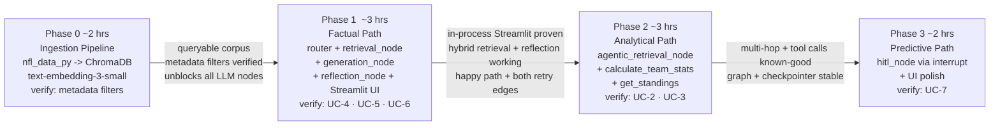

# Roadmap — NFL Stats Agent

Four phases, each ends with something runnable — see
[PRD.md §Success metrics](PRD.md#success-metrics), organized by phase
goal/unlock/rationale.

## Phase 0 — Ingestion pipeline (~2 hrs)

**Goal:** the walking skeleton — a queryable Chroma corpus, before any graph
exists.

**Ships:**
- `nfl_data_py` schedules loaded for 2021–2023
- Chunk formatter: one game = one text string (score, week, venue, surface,
  roof — only fields that exist in `games`, per `FR-1.2`)
- `season`, `game_type`, `week`, `home_team`, `away_team` attached as Chroma
  metadata alongside the embedded text
- Corpus embedded with `text-embedding-3-small`, upserted to
  `chromadb.PersistentClient` (`NFR-3`)

**Unlocks:** every later phase depends on this corpus existing and being
metadata-filterable; nothing downstream can be tested without it.

**Verify:** query Chroma directly with `where={"season": 2023, "game_type":
"POST"}` and confirm only the correct games return (`FR-1.2`'s acceptance
criterion) — this is the cheapest possible check that `ADR-003`'s hybrid
filter will actually work before any LLM is involved.

## Phase 1 — Factual path end-to-end: RAG + Reflection (~3 hrs)

**Goal:** the first full pattern pair, chosen first because it's the
simplest — no tool calls, no multi-hop loop, no interrupt.

**Ships:**
- LangGraph skeleton: `router_node` (analytical/predictive branches stubbed),
  `retrieval_node`, `generation_node`; compiled with `MemorySaver`
- `retrieval_node`'s hybrid split (`FR-1.1`): filter on stated
  season/game_type/week, semantic query on the rest
- `ui/app.py` wired directly to the compiled graph — `graph.stream(...)`
  with a `thread_id`, no backend (`ADR-002`)
- `reflection_node` with both retry edges (`FR-4.2`, `FR-4.3`), shared
  budget (`NFR-1`)

**Unlocks:** proves the no-backend, in-process Streamlit + checkpointer
setup (`ADR-002`) works at all, before adding the complexity of tool calling
or interrupts on top of it. Also proves the hybrid retrieval split
(`ADR-003`) on real queries.

**Verify:** UC-4 (should pass cleanly), UC-5 (coverage-failure route fires),
UC-6 (grounding-failure route fires) — confirms both reflection edges
actually trigger, not just the happy path.

## Phase 2 — Analytical path: Agentic RAG + tools (~3 hrs)

**Goal:** add the two more complex patterns — multi-hop retrieval and tool
calling — onto a graph already proven to work end-to-end on the simpler path.

**Ships:**
- `agentic_retrieval_node`: retrieve → `assess_sufficiency` →
  refine-and-retrieve loop (`FR-2.1`, capped per `NFR-2`)
- `calculate_team_stats` and `get_standings` tools (`FR-3.1`, `FR-3.2`),
  wired into `generation_node`
- `router_node`'s analytical conditional edge now live
- `reflection_node` reused on this path; coverage-failure edge retargeted to
  `agentic_retrieval_node` (not `retrieval_node`), grounding-failure edge
  unchanged (`ADR-004`)

**Unlocks:** the two-hop dependent query (UC-2) and the multi-tool-call
comparison (UC-3) — the patterns most likely to reveal a design flaw, now
tested against a graph whose simpler half is already known-good.

**Verify:** UC-2 confirms `assess_sufficiency` actually triggers a second,
different retrieval (not just a repeat of the first). UC-3 confirms two
distinct `calculate_team_stats` calls in one turn, not a single bundled call
(`FR-3.3`).

## Phase 3 — Predictive path: HITL + UI polish (~2 hrs)

**Goal:** the pattern that depends on the other four already working —
HITL gates a *generation* step, so retrieval, tools, and the overall
graph/checkpointer plumbing need to already be trustworthy.

**Ships:**
- `router_node`'s predictive conditional edge
- `hitl_node` via `interrupt()`, placed before `generation_node` (`FR-5.1`)
- Streamlit polish: team selector, chat window, `st.status` step visibility
- End-to-end demo across all three branches

**Unlocks:** nothing further — this is the last phase. Sequenced last
because debugging an `interrupt()`/resume issue is harder when the rest of
the graph (retrieval, tools, reflection) might also still be unproven; doing
it last means those are already known-good.

**Verify:** UC-7 — confirm no speculative text is produced before
confirmation (`FR-5.1`), and that declining produces `FR-5.2`'s
no-prediction response rather than a partial one.

## Sequencing rationale

Simplest-pattern-pair first (Phase 1), then the two patterns most likely to
expose a design flaw (Phase 2: multi-hop dependency, multi-tool-call
synthesis), then the pattern that structurally depends on everything else
already working (Phase 3: HITL gates generation, which by then has retrieval
and tools both proven). This order means a timebox slip surfaces against the
*cheapest* patterns first, not the most expensive ones — see [PRD.md
§Risks](PRD.md#risks).

## Cross-cutting — Observability layer

Added after Phase 1 landed, orthogonal to the five-pattern phase sequence
above rather than its own numbered phase: OpenTelemetry traces/metrics/logs
on every existing node, visualized in Tempo/Prometheus/Loki/Grafana (see
[ADR-008](ADRs.md#adr-008), [ARCHITECTURE.md §Observability](ARCHITECTURE.md#observability-adr-008)).
The `traced_node` decorator pattern carries forward automatically as Phase
2/3 nodes get built — they inherit it the same way `analytical_stub_node`/
`predictive_stub_node` already do.
