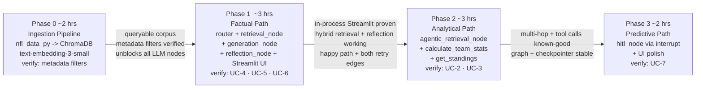

# Roadmap — NFL Stats Agent

Four phases, each ends with something runnable — see
[PRD.md §Success metrics](PRD.md#success-metrics), organized by phase
goal/unlock/rationale.

## Status at a glance

- [x] Phase 0 — Ingestion pipeline
- [x] Phase 1 — Factual path: RAG + Reflection (UC-4/5/6 verify pass recorded — see 1.7)
- [x] Cross-cutting — Observability layer
- [ ] Phase 2 — Analytical path: Agentic RAG + tools **← next**
- [ ] Phase 3 — Predictive path: HITL + UI polish

**Working convention:** each phase is broken into commit-sized sub-phases
below. A sub-phase is done when its change lands as its own git commit;
completed sub-phases reference the commit that shipped them.

## Phase 0 — Ingestion pipeline (~2 hrs) ✅

**Goal:** the walking skeleton — a queryable Chroma corpus, before any graph
exists.

**Sub-phases:**
- [x] 0.1 — Ingestion pipeline end-to-end: `nfl_data_py` schedules for
  2021–2023, chunk formatter (one game = one text string: score, week, venue,
  surface, roof — only fields that exist in `games`, per `FR-1.2`),
  `season`/`game_type`/`week`/`home_team`/`away_team` as Chroma metadata,
  corpus embedded with `text-embedding-3-small` and upserted to
  `chromadb.PersistentClient` (`NFR-3`), with a built-in metadata-filter
  verify step — `522bcad`

**Unlocks:** every later phase depends on this corpus existing and being
metadata-filterable; nothing downstream can be tested without it.

**Verify:** query Chroma directly with `where={"season": 2023, "game_type":
"POST"}` and confirm only the correct games return (`FR-1.2`'s acceptance
criterion) — this is the cheapest possible check that `ADR-003`'s hybrid
filter will actually work before any LLM is involved.

## Phase 1 — Factual path end-to-end: RAG + Reflection (~3 hrs) ✅

**Goal:** the first full pattern pair, chosen first because it's the
simplest — no tool calls, no multi-hop loop, no interrupt.

**Sub-phases:**
- [x] 1.1 — LangGraph/LangChain/Streamlit deps + provider-agnostic chat
  model config via `init_chat_model` (`ADR-006`) — `6c76e91`
- [x] 1.2 — Shared `GraphState`, `get_chat_model` wrapper, read access to
  the Chroma `games` collection — `68b71af`
- [x] 1.3 — `router_node` (factual/analytical/predictive classification,
  `FR-0.1`) + placeholder nodes for the un-built Phase 2/3 branches —
  `405e945`
- [x] 1.4 — `retrieval_node`'s hybrid split (`FR-1.1`): filter on stated
  season/game_type/week, semantic query on the rest; broadened search on
  coverage retries — `b5ad64a`
- [x] 1.5 — `generation_node` + `reflection_node` with both retry edges
  (`FR-4.2`, `FR-4.3`) and the shared 2-retry budget (`NFR-1`), plus
  `response_node` — `573fada`
- [x] 1.6 — Compile the graph with `MemorySaver`; `ui/app.py` wired directly
  to the compiled graph with a `thread_id`, no backend (`ADR-002`) —
  `e1ff663`
- [x] 1.7 — Recorded the verify pass: UC-4, UC-5, UC-6 (see **Verify**
  below), run against the live graph (`CHAT_MODEL_PROVIDER=groq`,
  `llama-3.3-70b-versatile`). UC-4 and UC-6 both passed reflection cleanly
  on every run (3/3 each): the corpus genuinely has no offensive-yards or
  passer-rating fields (`FR-1.2`'s chunk template is score/week/venue/
  surface/roof only), and the model correctly said so instead of
  hallucinating, satisfying `FR-4.1`/`FR-4.3`'s "not available" pass
  branch. UC-5 did **not** trigger `FR-4.2`'s coverage-failure retry in 6
  runs; instead the variance showed up one step earlier, in `retrieval_node`'s
  season extraction — 4/6 runs correctly resolved "2023" to `season=2023`
  (the actual Week 11 REG game, Eagles 21–17, verified against the public
  record) and the other 2/6 resolved it to the Super Bowl chunk
  (`season=2022` per the season-start convention) and produced a
  hedging/wrong answer that reflection accepted without retry. This is the
  same run-to-run reflection-judgment inconsistency observed earlier under
  Groq's `llama-3.3-70b-versatile` (UC-1 testing during Phase 1 build-out)
  — a known, accepted model-quality limitation of the smaller/faster
  provider, not a fresh regression — but it does mean the coverage-edge
  retry itself remains unobserved firing; revisit if Phase 2/3 testing
  needs that edge proven live, or reconfirm against `CHAT_MODEL_PROVIDER=
  anthropic` if the inconsistency needs to be isolated from the model choice.

**Unlocks:** proves the no-backend, in-process Streamlit + checkpointer
setup (`ADR-002`) works at all, before adding the complexity of tool calling
or interrupts on top of it. Also proves the hybrid retrieval split
(`ADR-003`) on real queries.

**Verify:** UC-4 (should pass cleanly), UC-5 (coverage-failure route fires),
UC-6 (grounding-failure route fires) — confirms both reflection edges
actually trigger, not just the happy path.

## Phase 2 — Analytical path: Agentic RAG + tools (~3 hrs) ⬅ next

**Goal:** add the two more complex patterns — multi-hop retrieval and tool
calling — onto a graph already proven to work end-to-end on the simpler path.

**Sub-phases:**
- [x] 2.1 — `pbp` data access (`graph/nfl_data.py`): play-by-play (2023,
  trimmed to the columns FR-3.1 needs), completed `games`, and the
  team→conference map, all lazy in-memory DataFrames, tools-only, never
  embedded (`ADR-007`); parquet-cached under `.nfl_cache/` so process
  restarts skip the download — `74466ff`
- [x] 2.2 — `calculate_team_stats` tool over the `pbp` DataFrame (`FR-3.1`):
  all five metrics, regular-season scope, fumble attribution by
  fumbling/recovering team; verified against the 2023 public record (KC 371
  pts / 21.8 ppg, KC −11 / SF +10 turnover diff) and cross-checked against
  the `games` DataFrame for all 32 teams. No `compare_teams` — comparisons
  are two calls (`ADR-005`)
- [x] 2.3 — `get_standings` tool (`FR-3.2`): W-L-T per conference/season
  aggregated from the `games` DataFrame only (no `pbp`), win-pct ordering
  with ties handled; verified against 2023 (BAL 13-4) and 2022 (HOU 3-13-1)
  public standings
- [x] 2.4 — `agentic_retrieval_node`: retrieve → `assess_sufficiency` →
  refine-and-retrieve loop (`FR-2.1`, capped per `NFR-2` = initial hop + 2
  refinements), loop fully inside the node (`ADR-004`), coverage retries
  re-enter with the reflection reason as a hint. Control flow (cap, early
  exit, refined-query plumbing, dedup) verified deterministically without
  APIs; live LLM/corpus behavior lands with 2.6's UC-2 verify — `69633a2`
- [ ] 2.5 — Wire the analytical branch live: tools bound into
  `generation_node`, `router_node`'s analytical conditional edge pointed at
  the real path, `analytical_stub_node` removed; `reflection_node` reused
  with its coverage-failure edge retargeted to `agentic_retrieval_node`
  (not `retrieval_node`), grounding-failure edge unchanged (`ADR-004`)
- [ ] 2.6 — Verify pass: UC-2 and UC-3 (see **Verify** below), plus the
  Phase 1 backlog item 1.7 if still open

**Unlocks:** the two-hop dependent query (UC-2) and the multi-tool-call
comparison (UC-3) — the patterns most likely to reveal a design flaw, now
tested against a graph whose simpler half is already known-good.

**Verify:** UC-2 confirms `assess_sufficiency` actually triggers a second,
different retrieval (not just a repeat of the first). UC-3 confirms two
distinct `calculate_team_stats` calls in one turn, not a single bundled call
(`FR-3.3`).

## Phase 3 — Predictive path: HITL + UI polish (~2 hrs)

**Goal:** the pattern that depends on the other four already working —
HITL gates a *generation* step, so retrieval, tools, and the overall
graph/checkpointer plumbing need to already be trustworthy.

**Sub-phases:**
- [ ] 3.1 — `hitl_node` via `interrupt()`, placed before `generation_node`
  (`FR-5.1`); `router_node`'s predictive conditional edge pointed at it,
  `predictive_stub_node` removed
- [ ] 3.2 — Streamlit interrupt/resume wiring: surface the confirmation to
  the user, resume on confirm, return `FR-5.2`'s no-prediction response on
  decline — no speculative text before confirmation
- [ ] 3.3 — Streamlit polish: team selector, chat window, `st.status` step
  visibility
- [ ] 3.4 — End-to-end demo across all three branches; verify pass: UC-7
  (see **Verify** below)

**Unlocks:** nothing further — this is the last phase. Sequenced last
because debugging an `interrupt()`/resume issue is harder when the rest of
the graph (retrieval, tools, reflection) might also still be unproven; doing
it last means those are already known-good.

**Verify:** UC-7 — confirm no speculative text is produced before
confirmation (`FR-5.1`), and that declining produces `FR-5.2`'s
no-prediction response rather than a partial one.

## Sequencing rationale

Simplest-pattern-pair first (Phase 1), then the two patterns most likely to
expose a design flaw (Phase 2: multi-hop dependency, multi-tool-call
synthesis), then the pattern that structurally depends on everything else
already working (Phase 3: HITL gates generation, which by then has retrieval
and tools both proven). This order means a timebox slip surfaces against the
*cheapest* patterns first, not the most expensive ones — see [PRD.md
§Risks](PRD.md#risks).

## Cross-cutting — Observability layer ✅

Added after Phase 1 landed, orthogonal to the five-pattern phase sequence
above rather than its own numbered phase: OpenTelemetry traces/metrics/logs
on every existing node, visualized in Tempo/Prometheus/Loki/Grafana (see
[ADR-008](ADRs.md#adr-008), [ARCHITECTURE.md §Observability](ARCHITECTURE.md#observability-adr-008)).
The `traced_node` decorator pattern carries forward automatically as Phase
2/3 nodes get built — they inherit it the same way `analytical_stub_node`/
`predictive_stub_node` already do.

**Sub-phases:**
- [x] O.1 — ADR-008 + PRD reword distinguishing dev-time transparency from
  production monitoring — `d84bcb1`
- [x] O.2 — Docker observability stack: OTel Collector, Tempo, Prometheus,
  Loki, Grafana with trace-to-logs/metrics correlation and a starter
  dashboard — `67006a4`
- [x] O.3 — `traced_node` decorator on every graph node + request/reflection
  counters; LLM calls auto-traced via LangChain instrumentation — `af873e6`
- [x] O.4 — Per-answer tracing in the Streamlit UI: Reasoning trail expander
  and Grafana trace deep link — `a346039`
